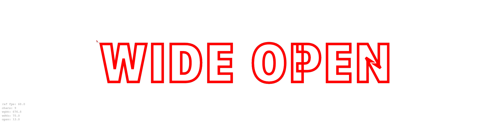

# Variable Text COMP

TouchDesigner component for rendering variable-font text through WebRender TOP.



## Download

Use `variable_text_comp.tox` from the repository or the `v1.0.0` GitHub release.

## What It Does

`variable_text_comp.tox` is a lightweight text-rendering component. It exposes typography and variable-font parameters as TouchDesigner custom parameters so they can be driven from outside with Constant CHOP, Animation COMP, exports, expressions, scripts, MIDI, OSC, or any other TD control network.

The component itself does not create animation curves. It only renders the current parameter values.

## Main Parameters

- `Text`: Text content.
- `Fontfile`: Local font file path.
- `Fontfamily`: CSS font family alias used inside WebRender.
- `Canvasw`, `Canvash`: WebRender output resolution.
- `Fontsize`: Font size in pixels.
- `Lineheight`: CSS line-height multiplier.
- `Letterspacing`: Tracking in pixels.
- `Alignx`: Horizontal text alignment.
- `Paddingx`, `Paddingy`: Internal text padding.
- `Textcolor`, `Opacity`: Fill color and opacity.
- `Transparent`, `Bgcolor`: Transparent output or solid background.
- `Stroke`, `Strokewidth`, `Strokecolor`: WebKit text stroke controls.

## Variable Font Axes

Built-in axis parameters:

- `Wght`: OpenType `wght` axis.
- `Wdth`: OpenType `wdth` axis.
- `Opsz`: OpenType `opsz` axis.
- `Slnt`: OpenType `slnt` axis.
- `Ital`: OpenType `ital` axis.
- `Grad`: OpenType `GRAD` axis.

Custom axis slots:

- `Axis1tag` + `Axis1value`
- `Axis2tag` + `Axis2value`
- `Axis3tag` + `Axis3value`
- `Axis4tag` + `Axis4value`

Example: set `Axis1tag` to `XTRA`, then export a CHOP channel to `Axis1value`.

`Customaxes` accepts a raw CSS `font-variation-settings` fragment, for example:

```text
"XTRA" 450, "YTAS" 750
```

## Usage

1. Drop `variable_text_comp.tox` into a TouchDesigner project.
2. Choose a variable font with `Fontfile`.
3. Drive exposed parameters directly.
4. Use `out1` as a TOP texture in Composite TOP, Transform TOP, Render TOP workflows, or any other TD network.

## Font Axis Notes

Every variable font supports different axes and value ranges. Read the font's `fvar` table or use a font inspection tool to find valid min/default/max values. Values outside the real font range may clamp, be ignored, or look like the animation stopped.

For Apple's SFNS font, common axes include:

```text
wdth  30-150
opsz  17-96
GRAD  400-1000
wght  1-1000
```

## Known Issue in 1.0.0 Release Asset

Dragging sliders rapidly can produce visual flicker in WebRender. This release preserves the current component state before the flicker fix.

The `main` branch includes a follow-up fix that throttles live parameter updates to one WebRender JavaScript push per frame.

## Credit

Concept and interaction reference: React Bits `Text Pressure` by React Bits.

Reference URL: https://reactbits.dev/text-animations/text-pressure?text=hello01&italic=false&width=false
